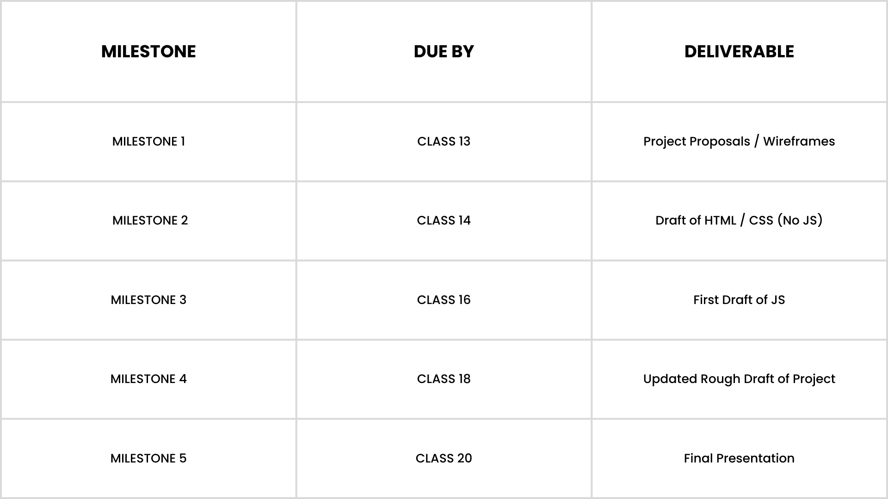
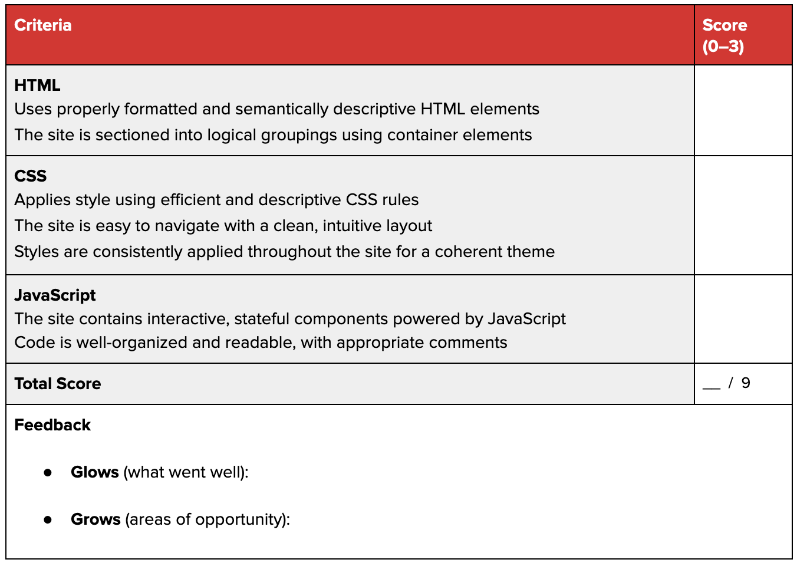

# Final Project Prompt

## Prompt
For the final project, you'll be designing and building a website of your choice. This project will test your knowledge of front-end web development and ask you to apply everything you've learned in this course. The result will be a website that you can add to your portfolio. You could create: a portfolio website; a marketing website for a startup or business; or a prototype for a simple web-app. Work with your instructor to create project goals that are realistic given the scope and timing of the class.

## Objectives
-  Demonstrate an understanding of all topics covered during this course:
  - Structure, design, and style your site with HTML and CSS
  - Use JavaScript to make your site interactive
  - Combine technical and design skills to create a responsive website that is compatible with mobile devices
- Apply knowledge gained during this course by building a website from scratch
- Use your creativity - your instructor will validate feasibility and manage scope

## Requirements
1. Use HTML to correctly structure the DOM:
  - Use HTML5 structural elements (header, footer, nav, footer)
  - Demonstrate correct use of classes and IDs
  - Select the appropriate tags to markup content
2. Use CSS to style the page:
  - Apply fonts, color, and styles to elements and the page
  - Demonstrate use of flex or grid properties and the box model
3. Use JavaScript to add interactive elements to the page

## Timeline
Besides the project proposal (due by Lesson 13) and your final presentation + project code (due the last day of class), there are no deliverables here.

Milestones 2, 3 and 4 are just for you to keep in mind and to help you stay on track.

However, keep in mind that you should absolutely not leave the entire project for the final weekend before our last class!

Take advantage of office hours and check in with your instructional team if you ever have questions!

## Evaluation Rubric
Your instructor will review your project and evaluate it against the rubric below. You will receive a score of 0–3 for each criterion:
- 0: Missing/incomplete
- 1: Does not meet expectations
- **2: Meets expectations (passing score)**
- 3: Exceeds expectations

Your grade will be the sum of these scores. **All scores must be greater than 1 for a passing grade.**

